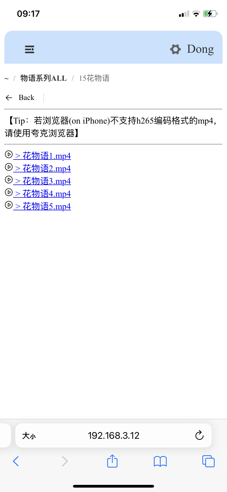
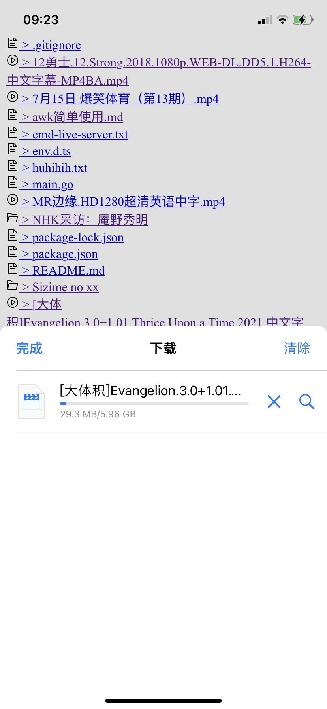
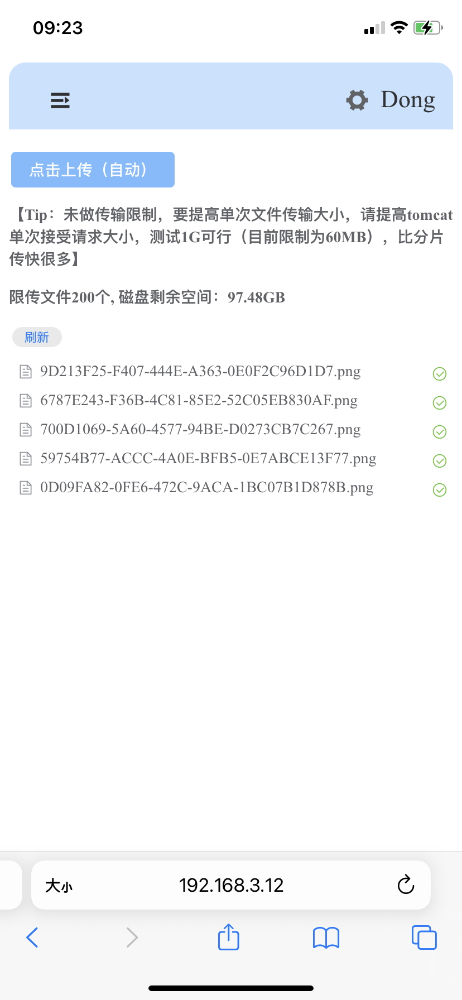

# roo-live-server
自用垃圾代码：用于局域网上传、下载、预览文件

# 零、基本功能 

## * 文件预览&下载

- 页头面包屑，方便返回
- 视频播放设置 range 响应头，按需加载
- 长按下载（单纯暴露uri）
- 相比 `live-server` 插件
  - 优势：1. 只加载当前目录，而 live-server 在目录深文件多时，卡顿严重；2. 视频流更可靠，live-server有时会卡住 (暂不清楚原因)
  - 劣势：1.启动麻烦，需双端；2.需手动配置各参数，不如 `live-server` 方便
- 相比 Synthing（略）

<figure>
    
    
</figure>

## * 上传文件

- 支持普通上传(单文件限制大小，需手动调)
- 支持分片上传

<figure>
    
    
</figure>

# TODO

## * 正在做

- 文件预览排序规则
- 文件列表查看方式，如平铺、内容、详细信息？
- 文件预览一次性加载不太好，应限制，如分页
- 抽离所有配置项
- 发送消息（如代码块、网址等，存储尽量不用数据库）
- 分片上传逻辑优化（目前仅为串行）

## * 再考虑

- 文件预览增强，如视频略缩图(ffmpeg?)、压缩包漫画预览、md文件预览等

* 端到端加密（没必要）
* MD5（没必要）